# Hi there 👋 I'm Zeyad Mohamed

 

---

# 🚀 About Me

I'm a **Full Stack Engineer**  passionate about building products from the ground up. I enjoy taking ownership of the entire development process—from transforming ideas into production-ready systems to ensuring they provide an exceptional experience for the people who use them.

---

# 🛠 Tech Stack

### Languages

### Backend

### Frontend

### DevOps & Cloud

### Tools

### Mobile

---

# 📊 GitHub Analytics

---

# 🐍 Contribution Graph

<picture>
  <source
    media="(prefers-color-scheme: dark)"
    srcset="https://raw.githubusercontent.com/Zeyadm8112/Zeyadm8112/output/github-snake-dark.svg">
  
</picture>

---

# 🚀 Featured Projects

---

# 🌐 Connect With Me

---

### 💡 *"Great software isn't just written—it's thoughtfully engineered."*

⭐ Thanks for visiting my profile!

